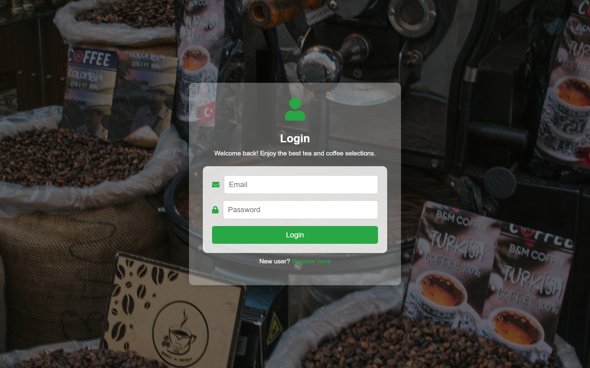
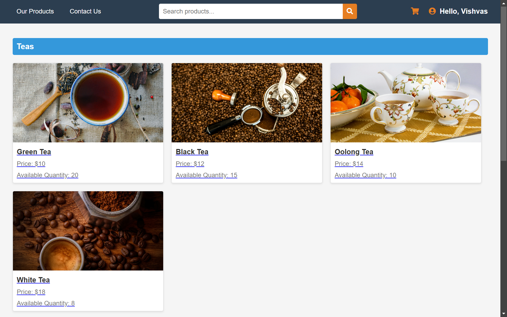
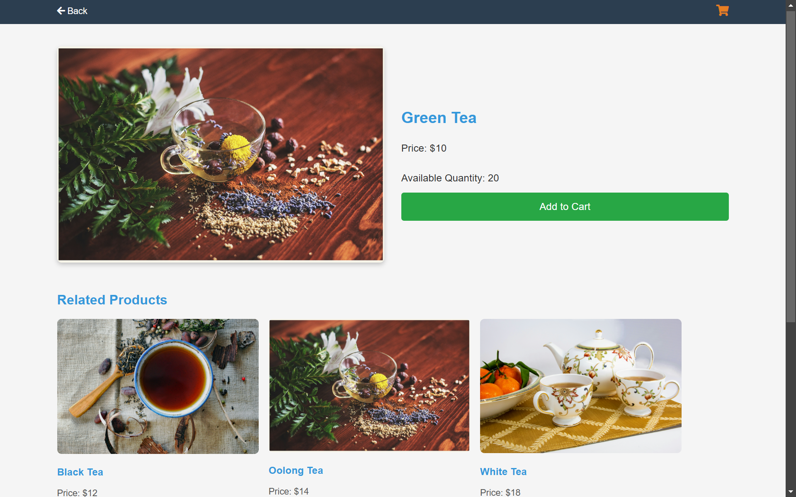
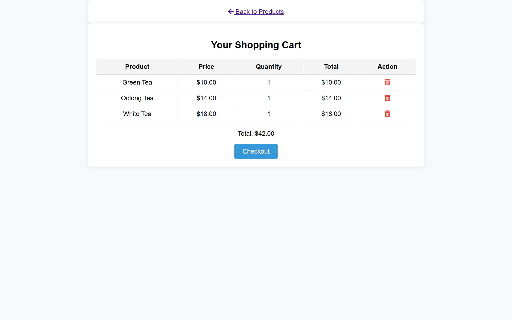
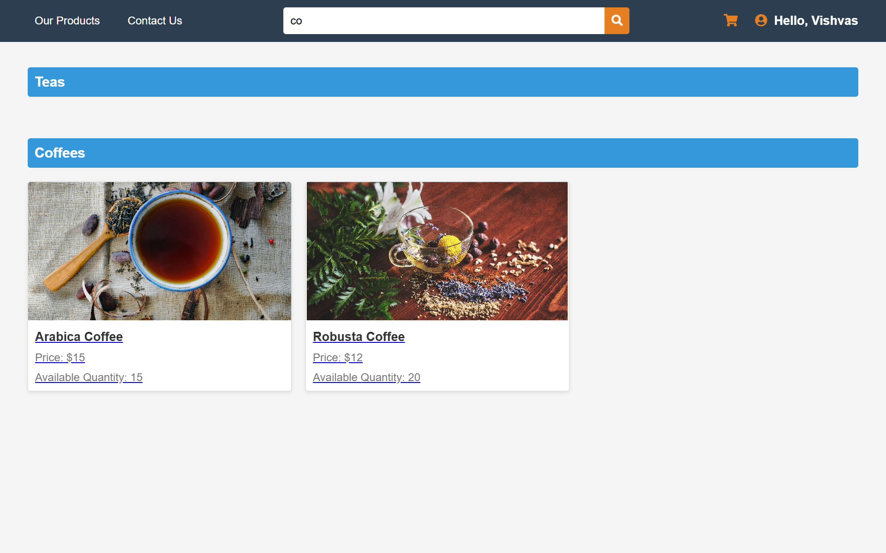
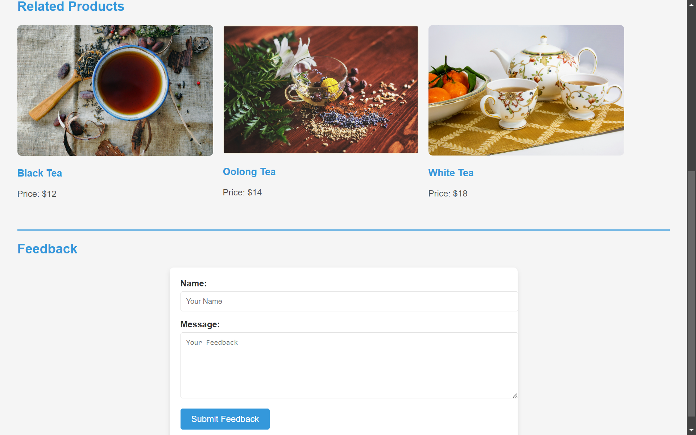
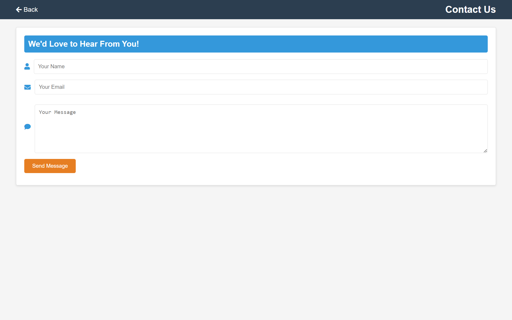

# Artisanal Tea and Coffee Marketplace

This project is an **eCommerce platform** designed for selling artisanal tea and coffee products. It features a user-friendly interface with functionalities such as product listings, cart management, user login, registration, personalized product recommendations, and more.

## Key Features:
- **Product Catalog**: Users can explore a variety of artisanal teas, coffees, and accessories.
- **User Registration**: New users can register with a simple form and start shopping immediately.
- **Shopping Cart**: Add products to the cart and manage it using local storage.
- **Product Details Page**: View detailed information about each product, including description and pricing.
- **Search Functionality**: Search for products based on keywords like name, type, or category.
- **Image Sliders**: Display related products with the help of the Cycle Plugin for image sliders.
- **Feedback Form**: A feedback form for users to share their experience with the website.
- **Contact Us Page**: Users can contact support for inquiries or feedback.

## Technologies Used:
- **HTML5**, **CSS3**, **JavaScript**, **jQuery**, **Cycle Plugin**, **Git**

## Screenshots:

### Login Page
The login page allows users to log into the platform by entering their email and password. It includes form validation and feedback messages (success or error).

### Screenshot:

---

### Register Page
The register page enables new users to create an account by providing their details. It includes form validation to ensure the information entered is correct.

### Screenshot:

---

### Product Listing Page
This page showcases a variety of artisanal teas and coffees. The products are displayed in a grid layout, and users can interact with each product to view details.

### Screenshot:

---

### Product Details Page
The product details page shows more information about a specific product, including a detailed description, price, and related product suggestions. Users can add the product to their cart from this page.

### Screenshot:

---

### Cart Page
The cart page displays the products added to the cart, along with the quantity, price, and total cost. Users can remove products before proceeding to checkout.

### Screenshot:

---

### Search Functionality
The search functionality allows users to search for products by name or category. This feature helps users quickly find what they are looking for.

### Screenshot:

---

### Feedback Form
The feedback form allows users to provide feedback on their shopping experience. This helps improve the user experience and gather insights for further development.

### Screenshot:

---

### Contact Us Page
The **Contact Us** page allows users to reach out for any inquiries or feedback. It includes a simple contact form with fields for the user’s name, email, and message.

### Screenshot:

---
